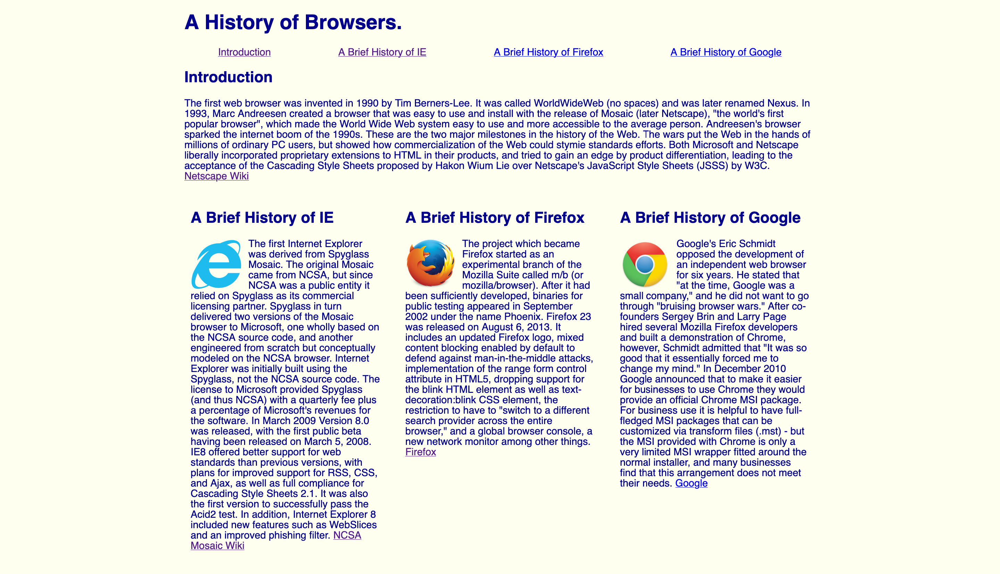
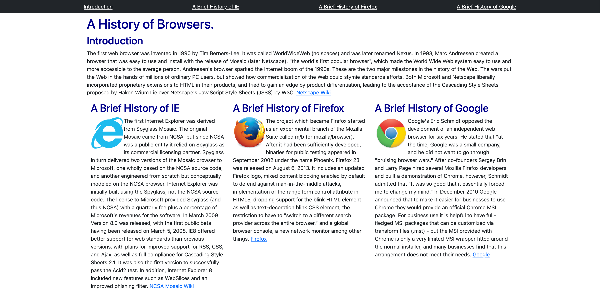

## My First Experience With HTML
When I first started coding in HTML I was excited to learn something that as I code and build I can see the changes in real time on a webpage. 
HTML is tricky in the sense that it is very simple at first, typing out on a website "Hello World" is arguably easier than it has been before in other languages up to this point. 
From there on I can say it certainly gets more difficult given all the different things you can do and are asked to do. Below is a picture of one of the first sites I built using HTML.

As you can see the website gets the idea across but could look cleaner whether it is the way the text is alligned or the way the images are paired with them it is not as neat looking as it could be. After learning more things you can do in HTML we then learned how to use Bootstrap 5 which made things much easier.

## Bootstrap 5
What was hard to understand, grasp, and accomplish in HTML prior to using a framework became much easier with the introduction of one. In particular in my situation the framework that saved the day was Bootstrap 5. Bootstrap 5 from the beginning felt much easier as when I tried to repeat the same project of building that browser history website it came out much cleaner and neater than without a framework as you can see below.

Just from a quick glance you can see the introduction of a neat looking navigation bar that has a background. All the colors and the formatting of the text look much better than before and when coding it in particular it was much easier. Overall it was easier and quicker to write it with Bootstrap 5 and the final product looks much better.

## Takeaway

Although Bootstrap 5 makes things easier that does not mean there is not a lot to learn with all of the different buttons and formats you have to learn, it is not all sunshines and rainbows. Not only does it test your knowledge of HTML a lot of time you have to keep open the documentation to quickly refer back to things so that you incorporate them correctly. In spite of that I can say that I prefer coding in HTML with a framework much more than without it though.
