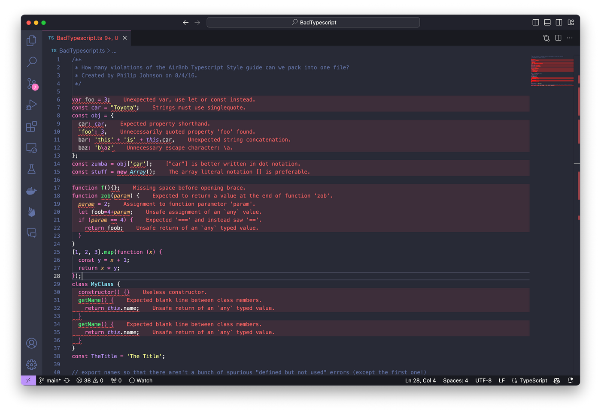

## Starting Messy but Ending Clean
  When I first ran ESlint it was more bothersome then helpful personally. I saw my code with zero errors light up with red squiggles everywhere telling me about indentations, single quotes, and more and at first I thought it was silly. After just one week of using it I can honestly say I am grateful to have it.

  The first reason I have for being grateful for ESlint is that it allows me to have neat looking compact code that is easier on the eyes. What I mean is that sometimes double spaces or lack of an indentation would pass by my eyes when I was coding and I would not change it.  This led to my code looking jumbled at times and overall not having a nice, “professional” look to it but with ESlint I can say it looks much better. Instead of remembering the style in which I am coding with and maintaining that look the whole time ESlint will give you many and I mean MANY errors indicating that your code is not looking how it is supposed to look.
  
  Outside of just my individual case another reason ESlint is great is how it helps you as the reader digest other people’s code. Instead of each person having small differences in their coding style which can lead to their code being harder to read with something like ESlint that throws errors when you are not following the standards it will make it so any person can look at your code or anyone who is using it and understand their intentions much easier.
  
  Overall ESlint was certainly stressful at first and even now I still have some issues during set up, I think ESlint as a means of enforcing coding standards is incredible. At times it can without a doubt be mentally taxing to go through many lines fixing small things just to appease the extension I think in it is still great to have.
